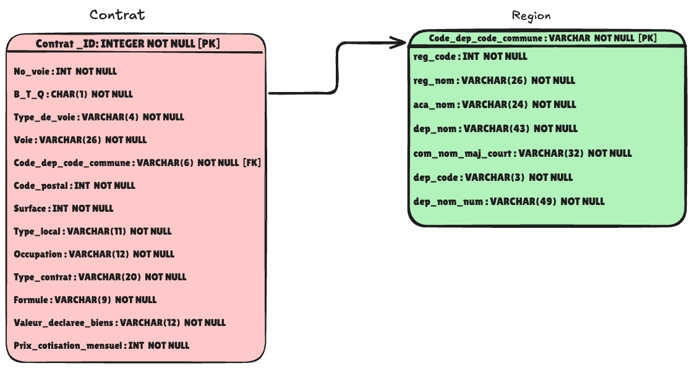

# Analyse d'une base de donnees d'assurances habitation - SQL

Projet realise dans le cadre de la formation **Data Analyst** (OpenClassrooms, RNCP Niveau 6).

## Contexte

Une compagnie d'assurances habitation souhaite exploiter sa base de donnees pour mieux comprendre son portefeuille de contrats. L'objectif est d'extraire des indicateurs cles a partir de requetes SQL pour repondre a des questions metier concretes.

## Schema relationnel



La base contient deux tables principales :
- **Contrat** : informations sur les contrats d'assurance (adresse, surface, type de local, formule, cotisation...)
- **Region** : donnees geographiques (commune, departement, region, academie)

Les tables sont liees par le champ `Code_dep_code_commune`.

## Competences mises en oeuvre

- Requetes SQL : SELECT, WHERE, ORDER BY, LIMIT
- Jointures entre tables (INNER JOIN)
- Fonctions d'agregation : COUNT, SUM, AVG, MIN, MAX
- Regroupement et filtrage : GROUP BY, HAVING
- Sous-requetes et requetes imbriquees
- Interpretation des resultats pour repondre a des besoins metier

## Structure du projet

```
sql-assurances-habitation/
├── README.md
├── data/
│   └── db_immobilier.db              # Base de donnees SQLite
├── docs/
│   ├── document_technique.pdf        # Document technique avec les requetes SQL
│   ├── methodologie_exploration.pdf  # Methodologie d'exploration des donnees
│   └── dictionnaire_donnees.xlsx     # Dictionnaire des donnees (description des champs)
└── images/
    └── schema_relationnel.png        # Schema relationnel de la base
```

## Outils utilises

- **SQLite** (DB Browser for SQLite)
- **SQL** (requetes d'analyse)

## Comment utiliser

1. Ouvrir `data/db_immobilier.db` avec [DB Browser for SQLite](https://sqlitebrowser.org/)
2. Consulter `docs/dictionnaire_donnees.xlsx` pour comprendre la structure des donnees
3. Les requetes SQL et l'analyse sont detaillees dans `docs/document_technique.pdf`

## Auteur

**Helton Dos Santos Moreira** - Data Analyst en formation
- [LinkedIn](https://www.linkedin.com/in/helton-dsm-data)
- [GitHub](https://github.com/Heltondsm)

Projet valide en fevrier 2026.
