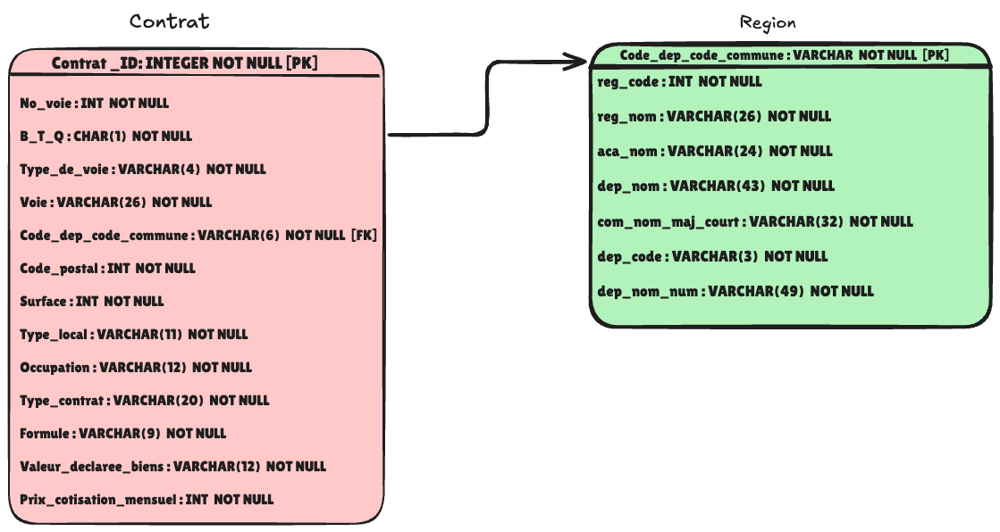

# 🏠 Assurance habitation : où sont les clients, et qu'est-ce qui fait le prix ?

Une base de **30 326 contrats** conçue de A à Z, puis interrogée en SQL pour répondre aux questions d'un assureur habitation. Résultat principal : **à Paris, la cotisation moyenne est 2,3 fois plus élevée qu'ailleurs, pour des logements plus petits.** C'est l'adresse qui fait le prix, pas la surface.

---

## 📖 Le problème

Un assureur habitation veut mieux connaître son portefeuille pour mieux accompagner ses clients. Ses données sont dans deux fichiers plats : les contrats d'un côté, le référentiel géographique des communes françaises de l'autre (data.gouv.fr). Impossible de répondre vite à une question simple comme « combien de contrats en Pays de la Loire, et à quel prix ? ».

---

## 🛠️ Ma solution

1. **Un dictionnaire des données** : chaque colonne décrite, avec son type et ses contraintes
2. **Un schéma relationnel normalisé** : deux tables, `contrat` et `region`, reliées par le code commune
3. **Une base SQLite** créée et chargée : 30 326 contrats et 38 916 communes
4. **12 requêtes métier** : filtres, agrégations, jointures, regroupements et classements



---

## 🔍 Ce que la base révèle

### 1️⃣ Près d'un contrat sur deux est en Île-de-France

| Région | Contrats | Part |
|---|---|---|
| Île-de-France | 14 177 | **46,7 %** |
| Provence-Alpes-Côte d'Azur | 3 279 | 10,8 % |
| Auvergne-Rhône-Alpes | 3 042 | 10,0 % |
| Nouvelle-Aquitaine | 2 038 | 6,7 % |
| Occitanie | 1 609 | 5,3 % |

Les 4 communes qui comptent le plus de contrats sont des arrondissements parisiens : le 18e (515), le 17e (468), le 15e (407) et le 16e (394).

### 2️⃣ L'adresse pèse plus que la surface dans le prix

```sql
-- Les 10 départements où la cotisation moyenne est la plus élevée
SELECT r.dep_code,
       r.dep_nom,
       ROUND(AVG(c.Prix_cotisation_mensuel), 2) AS cotisation_moyenne
FROM contrat c
JOIN region r ON c.Code_dep_code_commune = r.Code_dep_code_commune
GROUP BY r.dep_code, r.dep_nom
ORDER BY cotisation_moyenne DESC
LIMIT 10;
```

| Département | Cotisation moyenne par mois |
|---|---|
| Paris (75) | **36,40 €** |
| Hauts-de-Seine (92) | 26,27 € |
| Val-de-Marne (94) | 19,82 € |
| Yvelines (78) | 18,89 € |
| Rhône (69) | 18,49 € |

À Paris, un contrat coûte en moyenne **36,40 € par mois pour 51,8 m²**. Hors de Paris : **16,10 € pour 59,7 m²**. On paie 2,3 fois plus cher pour un logement plus petit.

### 3️⃣ Un portefeuille d'appartements et de résidences principales

- **91,8 %** des contrats couvrent un appartement, 8,2 % une maison
- **84,5 %** sont des résidences principales (25 612 contrats)
- **75 %** des biens assurés sont déclarés à moins de 25 000 €
- Les deux formules se partagent le portefeuille à parts presque égales : Classique (50,5 %) et Intégral (49,5 %)
- Au total, **7,03 millions d'euros** de cotisations par an

---

## 💡 Ce que ça permet de décider

- **Concentrer l'effort commercial là où sont les clients** : l'Île-de-France porte près de la moitié du portefeuille
- **Revoir la tarification sur des critères de localisation**, puisque c'est elle qui explique les écarts de prix, bien plus que la surface
- **Cibler l'offre sur le cœur du portefeuille** : des appartements en résidence principale, avec des biens de moins de 25 000 €

---

## 📋 Les 12 requêtes

| # | Question métier | Résultat |
|---|---|---|
| 1 | Contrats et surfaces du code postal 92100 | 98 contrats |
| 2 | Liste des régions de France | 19 régions |
| 3 | Contrats sur des résidences principales | 25 612 |
| 4 | Les 5 plus grandes surfaces assurées | de 559 à 815 m² |
| 5 | Cotisation mensuelle moyenne | 19,33 € |
| 6 | Contrats par tranche de valeur déclarée | 22 712 sous 25 000 € |
| 7 | Formules Intégral en Pays de la Loire | 589 |
| 8 | Maisons assurées dans le département 71 | 4 contrats |
| 9 | Surface moyenne à Paris | 51,8 m² |
| 10 | Top 10 des départements par cotisation | Paris en tête, 36,40 € |
| 11 | Communes avec au moins 150 contrats | 20 communes |
| 12 | Contrats par région | Île-de-France en tête, 14 177 |

---

## 🛠️ Technologies

- **SQLite** : base de données relationnelle
- **SQL** : filtres, agrégations, jointures, `GROUP BY`, `HAVING`, `ORDER BY`

---

## 📂 Structure du projet

```
.
├── README.md
├── data/
│   └── db_immobilier.db               # Base SQLite : 30 326 contrats, 38 916 communes
├── docs/
│   ├── dictionnaire_donnees.xlsx      # Dictionnaire des données
│   ├── document_technique.pdf         # Les 12 requêtes et leurs résultats
│   └── methodologie_exploration.pdf   # La démarche, étape par étape
└── images/
    └── schema_relationnel.png         # Schéma de la base
```

---

*Projet réalisé dans le cadre du Bachelor Data Analyst d'OpenClassrooms.*
